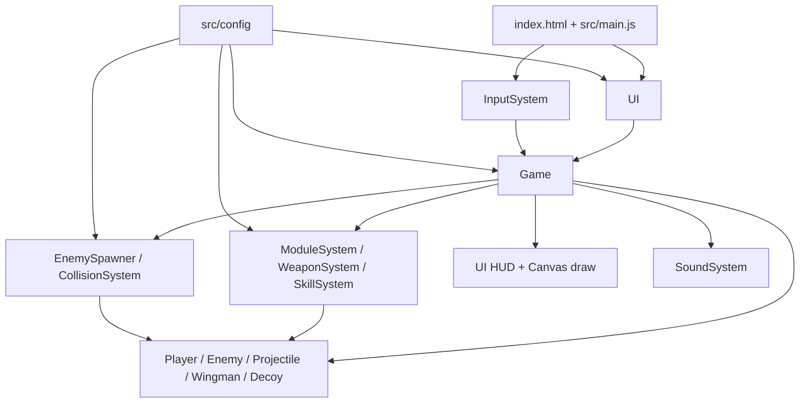

# 架构说明

## 入口与页面

- `index.html`：页面骨架、主菜单、设置、百科、模式选择、教程、关卡选择、改装界面、战斗 HUD 和结算层；底部加载 `src/main.js`。
- `src/main.js`：创建 `UI`、`InputSystem`、`Game`，把 UI 回调接到游戏方法，并开始菜单渲染。
- `tests/index.html`：浏览器逻辑测试入口，加载 `tests/logic-tests.js`。
- `src/ui/BeyondLightConeUI.js`：由 `UI` 在运行时注入光锥之外界面，因此部分 Beyond DOM 不在 `index.html` 静态骨架中。

## 目录与模块

| 层 | 真实文件 | 职责 |
| --- | --- | --- |
| 配置 | `src/config/*.js` | 模块、敌人、Boss、关卡、环境、事件、难度、百科和连携能力的声明 |
| 核心 | `src/core/Game.js` | 模式状态、`requestAnimationFrame` 主循环、生成、更新、碰撞后处理、结算和 Canvas 绘制 |
| 实体 | `src/entities/Player.js`、`Enemy.js`、`Projectile.js`、`Decoy.js`、`Wingman.js` | 位置、属性、行为、更新和实体绘制 |
| 系统 | `src/systems/ModuleSystem.js` | 装配校验、统计合并、技能模块数量和断开模块清理 |
| 系统 | `src/systems/WeaponSystem.js` | 自动模块开火、行为工厂、模块发射源和攻速规则 |
| 系统 | `src/systems/SkillSystem.js` | 技能列表、冷却和按索引触发 |
| 系统 | `src/systems/CollisionSystem.js` | 圆/矩形碰撞、伤害、爆炸、链式效果、治疗和玩家接触伤害 |
| 系统 | `src/systems/EnemySpawner.js` | 按权重从当前模式敌池生成敌机 |
| 系统 | `src/systems/InputSystem.js` | 键盘、指针、触摸拖动和画布坐标映射 |
| 系统 | `src/systems/BeyondLightConeSystem.js` | 航程随机地图、节点、事件、库存、奖励和航程码；合成代码仅作暂停开发的内部存放 |
| 系统 | `src/systems/LocalSaveSystem.js` | 浏览器本地存档、普通模式十槽机库和光锥之外安全断点 |
| 系统 | `src/systems/LoadoutCodec.js` | 普通机体配置码的紧凑编码、校验和解析 |
| 系统 | `src/systems/SoundSystem.js` | Web Audio 音效、背景音乐调度和音量 |
| UI | `src/ui/UI.js` | 静态页面、改装交互、百科、HUD、设置和模式切换 |
| UI | `src/ui/BeyondLightConeUI.js` | 光锥之外地图、商店、事件、存档码和结果弹窗；不提供合成玩家入口 |
| 绘制 | `src/rendering/ModuleRenderer.js`、各实体/场景 `draw` | Canvas 几何图标、飞机、敌人、子弹、背景和战斗特效 |

## 状态管理与数据流

`Game` 是运行时状态的中心，但内容定义不应全部写入 `Game.js`。`UI` 负责显示和用户意图，系统负责可复用规则，实体负责自身状态，配置负责内容参数。`LocalSaveSystem` 负责浏览器本地持久化：普通模式由 `UI` 保存当前十槽机库，光锥之外由 `Game` 保存安全航程断点。普通机体仍通过 `LoadoutCodec` 生成配置码，光锥之外仍通过 `BeyondLightConeSystem.encode/decode` 生成航程存档码，用于分享和跨设备迁移。

## 渲染流程

`Game.frame()` 使用 `requestAnimationFrame`，计算 `dt` 后进入 `update()`，随后 `render()`：背景/星空 → 敌方与玩家弹幕 → 敌机、Boss、僚机和分身 → 玩家机体 → 伤害数字与爆炸/光束等反馈。菜单背景由 `MenuAmbientRenderer`、`AppAmbientRenderer`、`MainMenuFlightRenderer` 独立维护，并在页面隐藏时停止动画。

## 新增功能应该修改哪里

| 需求 | 首选入口 | 需要同步检查 |
| --- | --- | --- |
| 新自动模块 | `src/config/module-config.js` + `WeaponSystem.js` behavior | `ModuleRenderer.js`、百科、`FEATURES.md`、测试 |
| 新主动技能 | 模块 `skill` 配置 + `SkillSystem.js` + `Game.js` | HUD 技能按钮、冷却、教程、碰撞/绘制、测试 |
| 新敌机 | `enemy-config.js` | `Enemy.js` 行为、`WeaponSystem` 敌方射击、关卡池、百科 |
| 新 Boss | `createBossDefinition()` 与 Boss 绘制/攻击逻辑 | Boss 关结算、百科、关卡数据、测试 |
| 新关卡或环境 | `level-config.js` / `environment-config.js` | `Game.js` 生成与 HUD、关卡选择、README/功能文档 |
| 新躲避弹幕 | `Game.js` 的 dodge pattern | `Projectile.js`、躲避难度、触摸/暂停、测试 |
| 新光锥之外节点/事件 | `beyond-events-config.js` / `BeyondLightConeSystem.js` | `BeyondLightConeUI.js`、存档兼容、奖励池、测试 |
| 新页面或弹窗 | `index.html` 或动态 UI 注入 | `UI.js`、`styles.css`、桌面/移动端检查 |

## 构建与发布边界

源文件直接运行，不经编译。`package-release.ps1` 会删除并重新生成被忽略的 `publish-package/`，再按需要生成 `neon-skies-publish.zip`；因此发布前必须以源目录为准重新打包，不能手工维护生成目录。
